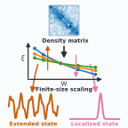

# Density-Matrix-for-Anderson-Localization

paper: https://arxiv.org/abs/2509.26206

Accepted in PRX: https://journals.aps.org/prx/accepted/10.1103/y5kd-7prs

<em><strong>We warmly welcome you to follow, use, and further develop the density matrix framework to explore rich localization problems.</strong></em>

### Authors and contributions

- Ziyue Qi (IOP, UCAS)
- Yi Zhang (SHU)
- Mingpu Qin (SJTU)
- Hongming Weng (IOP, UCAS)
- Kun Jiang (IOP, UCAS)

## Brief introduction

We provide a new framework to study Anderson localization via the density matrix. From it, we directly extract the localization length, which measures how far electrons spread in a system. Combined with finite-size scaling, this approach distinguishes metallic and insulating behavior across different dimensions naturally extends to interacting systems by using many-body ground-state wave functions. 

- For non-interacting systems, we define modular density matrix (MDM). The localization lengths extracted from it are benchmarked with standard transfer matrix method (TMM) and typical medium dynamical cluster approximation (TMDCA).

- For interacting systems, we define the subtraction density matrix (SDM) and calculate it using DMRG. We used this method to show
  (1) attractive interactions promote metallic behavior in disordered one-dimensional systems,
  (2) a metallic tendency in disordered two-dimensional Hubbard models.

## Code instruction

This repository provides the **source code** and **raw data** supporting the results in **arXiv:2509.26206**, including the figures in the paper and the corresponding processed datasets used in the plots.

The project is organized into two parts:

- **Non-interacting:** Localization length, including finite-size scaling and data collapse analysis, from the MDM and benchmarks with the TMM for 
  -  the 3D Anderson model, 
  -  the 2D Anderson model with SOC 
  -  a two-orbital model, 
- **Interacting:** Localization length from the SDM for 
  - a 1D spinless interacting model 
  - the 2D Anderson-Hubbard model. 
Many-body ground-state wave functions are computed from DMRG. Data processing scripts and benchmark results are also provided. 

---
